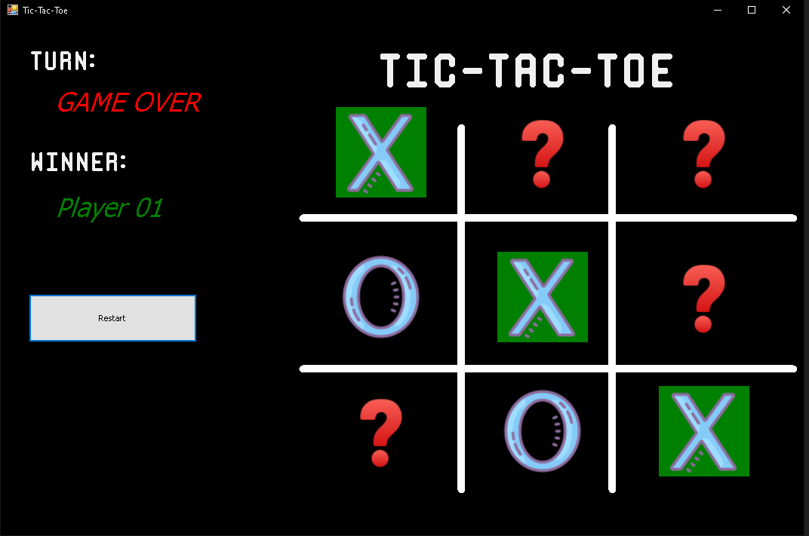

# Tic-Tac-Toe game

Desktop application programed using .NET Framework, C#, and Windows forms. you can only play against the computer.

---
## How to use
1. Clone this repo.
2. Run Visual Studio 2022.
3. Build and run the project.

---
